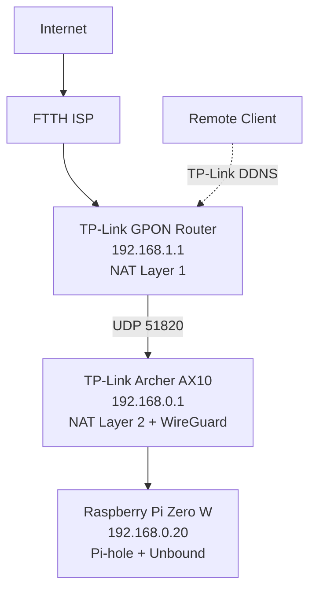

# Event Horizon — Pi-hole + Unbound Recursive DNS Server with WireGuard Remote Access

> A production-style home DNS and remote-access infrastructure built on a Raspberry Pi Zero W, running behind a dual-NAT homelab network.

---

## Project Overview

Event Horizon is a self-hosted, network-wide DNS filtering and recursive resolution platform, paired with a WireGuard VPN gateway for secure remote access to the entire home network.

Instead of forwarding DNS queries to public resolvers such as Cloudflare or Google, Pi-hole forwards requests to a locally hosted Unbound resolver, which performs full recursive resolution directly against the global DNS hierarchy. Remote access is provided through a WireGuard VPN running on a second router, reachable from anywhere via TP-Link Dynamic DNS — no admin interface is ever exposed directly to the internet.

The project emphasizes:

- Linux system administration
- Network infrastructure, including a deliberate dual-NAT topology
- DNS architecture and recursive resolution
- DNSSEC validation
- VPN-based remote access
- Defense-in-depth security hardening
- Troubleshooting and infrastructure documentation
- Professional, portfolio-quality technical writing

---

## Features

- Network-wide advertisement and tracker blocking
- Fully recursive DNS resolution (no third-party recursive resolver)
- DNSSEC validation
- Local DNS caching
- WireGuard VPN remote access, reachable via TP-Link Dynamic DNS
- HTTPS admin interface with two-factor authentication
- SSH key authentication, Fail2ban, and a default-deny UFW firewall
- Automatic security updates and scheduled configuration backups
- Raspberry Pi Zero W deployment behind a dual-NAT homelab network
- Professional, book-style documentation

---

## Architecture



Full topology, addressing, and the DNS resolution path are covered in the [complete documentation](book/SUMMARY.md).

---

## Hardware

| Component | Value |
|-----------|-------|
| Platform | Raspberry Pi Zero W |
| Storage | 64 GB microSD |
| Network | USB Ethernet Adapter (via OTG) |
| Hostname | event-horizon |
| Operating System | Raspberry Pi OS Lite (32-bit), Debian 13 "Trixie" |

---

## Software Stack

| Component | Version |
|-----------|---------|
| Raspberry Pi OS | Trixie |
| Pi-hole | v6.4.3 |
| Pi-hole FTL | v6.7 |
| Unbound | v1.22.0 |

> **Note:** Versions reflect the state of the system at the time of writing. The live deployment runs current patches per the automatic security update policy in [Part 3: Security](book/03_Security/README.md), so the running version may be newer than what's listed here.

---

## Network Topology

| Layer | Device | Address |
|---------|----------|---------|
| NAT Layer 1 | TP-Link GPON Router | 192.168.1.1 |
| NAT Layer 2 | TP-Link Archer AX10 (WireGuard server) | 192.168.0.1 |
| — | Pi-hole + Unbound | 192.168.0.20 |
| — | Unbound (internal) | 127.0.0.1:5335 |
| VPN Tunnel | WireGuard peers | 10.5.5.0/24 |

See [Chapter 5: Network Architecture](book/01_Foundation/05_Network_Architecture.md) for the full dual-NAT design and remote access path.

---

## Documentation

This project is documented as a full technical book, covering every stage from design through operations:

**[📖 Read the full documentation — start here (SUMMARY.md)](book/SUMMARY.md)**

| Part | Covers |
|---|---|
| 1. Foundation | Objectives, requirements, hardware, network architecture |
| 2. Platform Deployment | OS install, Linux config, network config, Pi-hole, Unbound |
| 3. Security | HTTPS, 2FA, SSH hardening, Fail2ban, UFW, WireGuard, DDNS |
| 4. Validation | Functional and performance testing against Chapter 2's success criteria |
| 5. Operations | Daily/weekly/monthly maintenance, backups, disaster recovery |
| 6. DNS Theory | The concepts behind the deployment, for readers who want the "why" |
| 7. Troubleshooting | Every real issue hit during the build, with root cause and fix |
| Appendices | Config file reference, diagrams, command cheat sheet, security audit checklist, future enhancements |

---

## Project Structure

```text
book/
  01_Foundation/
  02_Platform_Deployment/
  03_Security/
  04_Validation/
  05_Operations/
  06_DNS_Theory/
  07_Troubleshooting/
  Appendices/
  SUMMARY.md
configs/
diagrams/
screenshots/
```

---

## Validation Highlights

- Pi-hole and Unbound services operational, ports 53 and 5335 confirmed listening
- Recursive DNS resolution and DNSSEC trust anchor confirmed working end to end
- Pi-hole forwarding exclusively to the local Unbound instance (`127.0.0.1#5335`)
- Cold DNS lookup: 300–700 ms · Cached lookup: < 20 ms

Full results in [Part 4: Validation](book/04_Validation/README.md).

---

## Security Highlights

- HTTPS-only administration with TOTP two-factor authentication
- SSH public-key authentication, Fail2ban brute-force protection
- Default-deny UFW firewall, only required ports exposed
- No admin interface exposed to the internet — WireGuard only, via TP-Link DDNS
- Automatic security updates and scheduled configuration backups

Full detail in [Part 3: Security](book/03_Security/README.md).

---

## Future Improvements

- High-availability secondary Pi-hole
- DNS-over-TLS (DoT) testing
- Monitoring with Prometheus and Grafana
- UPS integration
- IPv6-only testing
- CI validation for documentation

Full reasoning in [Appendix F: Future Enhancements](book/Appendices/Appendix_F_Future_Enhancements.md).

---

## License

This project is released under the MIT License.This project documents the deployment and operation of several third-party open-source technologies, including Pi-hole, Unbound, WireGuard, and others. These software components remain subject to their respective licenses. The MIT License applies only to the original documentation, scripts, diagrams, and other original content contained in this repository.
