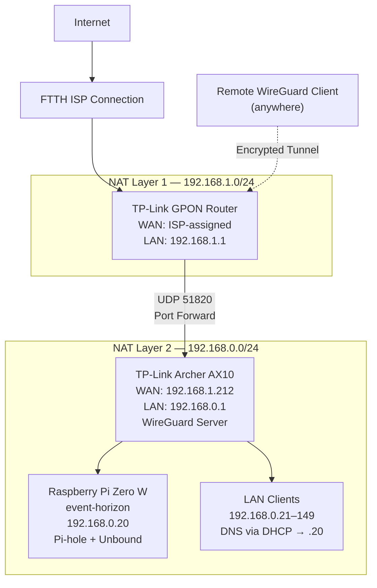

# Chapter 5: Network Architecture

With the hardware in place, this chapter covers how Event Horizon fits into the wider network — specifically, the dual-NAT, dual-router topology it deliberately runs behind, and how remote access, DNS distribution, and the two NAT layers interact.

## Topology Overview

The network sits behind two independent NAT layers, each managed by a different router:

- **TP-Link GPON Router** — the ISP-facing device, terminating the FTTH connection and performing the first NAT translation from the public internet.
- **TP-Link Archer AX10** — connected as a client of the GPON router, performing a second, independent NAT translation for its own LAN. This is the network the Raspberry Pi and all client devices actually live on, and it also runs the WireGuard VPN server.

Traffic from the internet to the home network crosses both NAT boundaries; traffic from the AX10's LAN out to the internet does the same in reverse.

## Network Diagram

## Addressing

| Layer | Device | Address |
|---|---|---|
| NAT Layer 1 | TP-Link GPON Router (LAN) | 192.168.1.1 |
| NAT Layer 1 | TP-Link Archer AX10 (WAN-side) | 192.168.1.212 — DHCP Reservation |
| NAT Layer 2 | TP-Link Archer AX10 (LAN) | 192.168.0.1 |
| NAT Layer 2 | Raspberry Pi (event-horizon) | 192.168.0.20 — DHCP Reservation |
| NAT Layer 2 | Client devices | 192.168.0.21–149 — DHCP |
| WireGuard Tunnel | VPN peer addresses | 10.5.5.0/24 (each peer assigned an individual /32) |

The Pi's address is a DHCP reservation on the AX10, not a manually configured static IP — the AX10 manages addressing centrally, and the Pi receives the same address on every boot without any network configuration stored on the device itself.

## DNS Distribution to Clients

Clients are not configured individually to use Pi-hole. Instead, the AX10's DHCP server hands out `192.168.0.20` as the DNS server to every device on the LAN automatically, as part of normal DHCP lease assignment. This is what makes the blocking and filtering "network-wide" — any device that joins the LAN is covered without additional setup.

## Remote Access via WireGuard

Remote access follows the same dual-NAT chain in reverse:

1. A remote WireGuard client resolves the GPON router's public address via **TP-Link DDNS**, since the FTTH ISP assigns a dynamic public IP rather than a fixed one. The GPON router's built-in DDNS client keeps this hostname pointed at the current public IP automatically.
2. The client connects to that hostname on UDP port 51820.
3. The GPON router's virtual server (port-forwarding) rule directs that UDP 51820 traffic to `192.168.1.212` — the AX10's WAN-side address — on the same port.
4. The AX10, running the WireGuard server itself, accepts the tunnel, assigns the client an address from its `10.5.5.0/24` tunnel range, and routes it into its own LAN (`192.168.0.0/24`) — giving remote access not just to the Pi, but to the entire home network behind the AX10.

| Setting | Value |
|---|---|
| External port (GPON) | UDP 51820 |
| Internal target (GPON → AX10) | 192.168.1.212, port 51820 |
| AX10 WAN-side address stability | DHCP Reservation — will not change on renewal |
| WireGuard tunnel range | 10.5.5.0/24, individual peers assigned a /32 |

Because the AX10's WAN-side address is a DHCP reservation rather than a regular lease, the GPON router's port-forward rule stays valid indefinitely without needing to be manually updated after a lease renewal or reboot.

## Why Dual NAT

As covered in Chapter 1, this topology is a deliberate choice rather than a limitation to work around. Running two independent NAT layers surfaces real-world problems — port-forward chaining, WAN-side addressing stability, routing between two private subnets — that a single-router network would never require solving.

---

The next chapter moves into Part 2 of this book: the actual platform deployment, starting with the Raspberry Pi OS installation itself.
