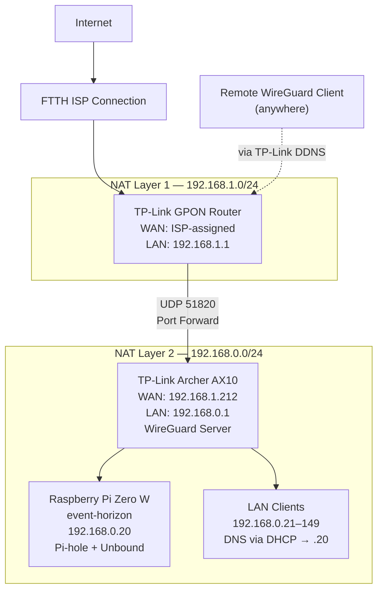
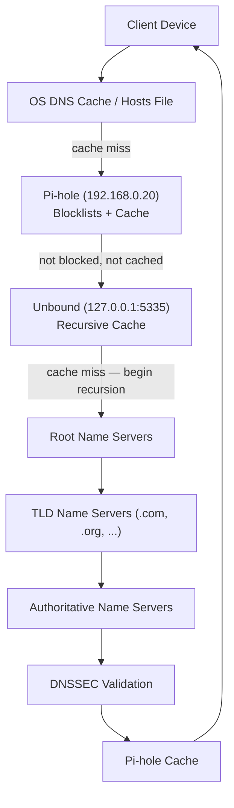
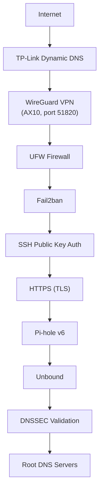

# Appendix B: Network & DNS Flow Diagrams

A consolidated visual reference pulling together every diagram referenced across this book, in one place.

## Physical & Logical Topology (Dual-NAT)

Referenced in Chapter 5. Shows the two independent NAT layers and where each device sits.

## DNS Resolution Flow

Referenced in Part 6 (DNS Theory). Shows a single query's full path from client to authoritative server and back.

## Remote Access & Defense-in-Depth

Referenced in Chapter 5 and Part 3 (Security). Shows the full layered path a remote administrator's connection passes through.

---

**Appendix C** provides a consolidated command reference — every command from every chapter, grouped by purpose, for quick lookup without hunting back through individual chapters.
